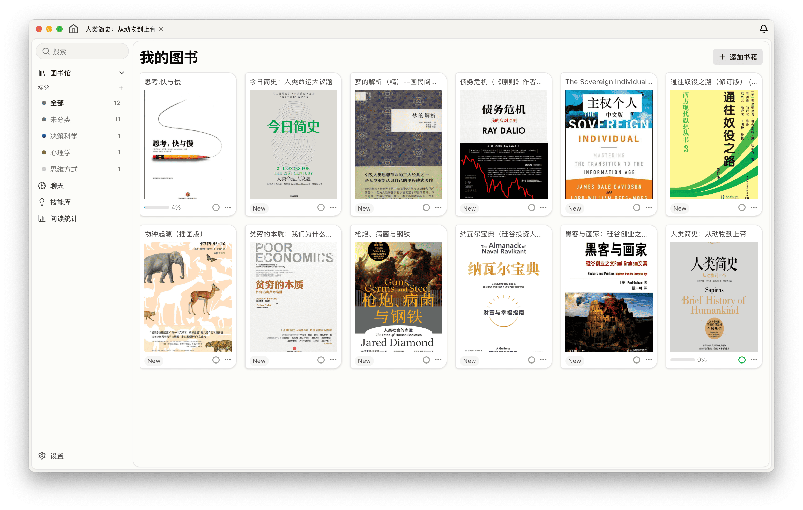
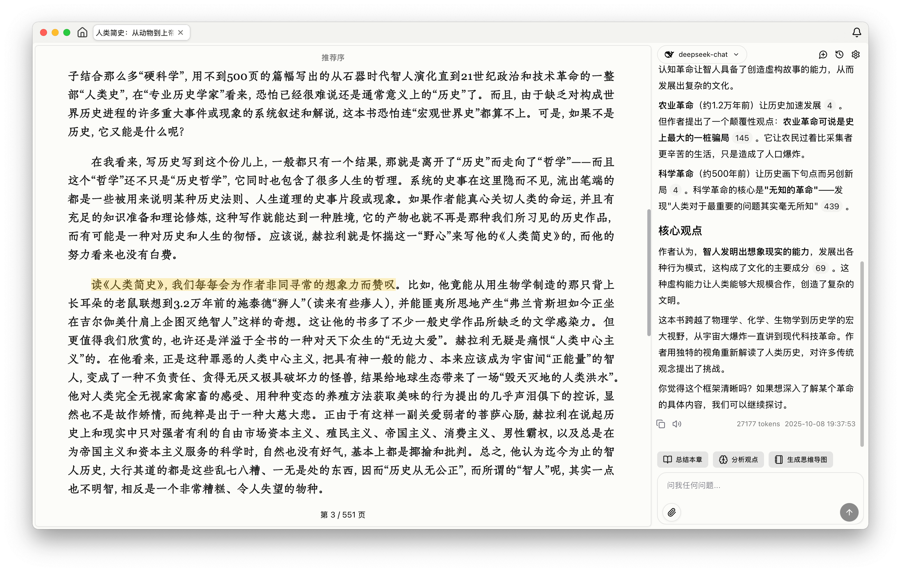
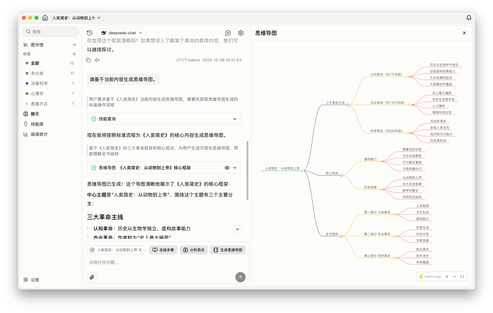

# DeepReader

**一款支持 AI 深度阅读的电子书阅读器**

  

 

DeepReader 是一款专注深度阅读的电子书阅读器。你可以在阅读时随时与 AI 对话——AI 理解书籍内容、记住你的阅读历史、诊断你的真实问题，而不只是完成表面提问。

所有数据本地存储，支持自配置 AI 服务（OpenAI / Anthropic / DeepSeek / OpenRouter 等）。

> **基于 [SageRead](https://github.com/xincmm/sageread) 二次开发**，感谢原作者的开源工作。DeepReader 在其基础上增加了 AI 记忆系统、意图诊断、智能 token 路由等能力。

---

## ✨ 核心特性

| Feature | Description | Status |
| :--- | :--- | :---: |
| 📖 **智能阅读器** | 支持 EPUB 格式，流畅阅读体验，滚动和分页双模式 | ✅ |
| 🤖 **AI 对话助手** | 实时理解书籍内容，意图诊断先于回答，减少答非所问 | ✅ |
| 🧠 **AI 记忆系统** | 三区记忆（用户偏好/书籍认知/概念定义），跨 session 持续积累 | ✅ |
| ✍️ **笔记标注系统** | 高亮标注、书签管理、文本摘录，所有笔记永久保存本地 | ✅ |
| 📊 **阅读统计分析** | 可视化阅读数据，追踪阅读习惯、进度和时长统计 | ✅ |
| 🎯 **自定义技能** | 创建个性化 AI 工作流模板，打造专属阅读 SOP | ✅ |
| 🔍 **全文搜索** | 快速搜索书籍内容，精准定位关键章节和段落 | ✅ |
| 🔊 **TTS 朗读** | 内置文字转语音功能，支持多语言朗读，解放双眼 | ✅ |
| 🎨 **主题定制** | 深色/浅色主题切换，自定义字体、布局和配色方案 | ✅ |
| 🔒 **隐私优先** | 所有数据本地存储，支持自部署 AI 模型，保护阅读隐私 | ✅ |

---

## 🎬 功能展示

---

## 使用引导

### 1. 配置 AI 对话模型

打开 **设置 → 模型提供商**，填写：
- API Key
- Base URL（如 `https://api.openai.com/v1`）
- 模型名称（如 `gpt-4o`、`deepseek-chat`、`claude-3-5-sonnet-latest`）

支持 OpenAI、Anthropic、DeepSeek、OpenRouter 等所有兼容 OpenAI 接口的服务。

### 2. 配置向量模型（RAG 语义检索）

打开 **设置 → 向量模型配置**，配置 Embedding 模型：
- 支持在线 API（推荐：`text-embedding-3-small`）
- 支持本地模型（仅 macOS）

向量模型用于书内语义搜索，配置后 AI 可以检索全书内容而不仅限于当前页面。

### 3. 配置记忆提取模型（可选）

打开 **设置 → 通用**，在「记忆提取模型」中选择一个轻量模型（推荐 `gpt-4o-mini` 或 `deepseek-chat`）。

记忆提取在后台静默运行，使用轻量模型可以降低成本。

### 4. 配置 Obsidian 路径（可选）

打开 **设置 → 通用**，填写你的 Obsidian 知识库路径。配置后可以用 `/笔记格式化` 技能直接将 AI 对话保存为 Obsidian 笔记。

### 5. 开始向量化

导入书籍后，在图书库中选择书籍 → 点击「开始向量化」→ 等待处理完成。

向量化完成后即可使用 AI 对话的全书语义检索功能。

---

## AI 技能（斜杠命令）

在对话框中输入技能名称即可触发：

| 技能 | 说明 |
|------|------|
| `/解释概念` | 从定义、推理链、实例三层解释一个概念 |
| `/生成知识图谱` | 将当前讨论转为 Mermaid 思维导图 |
| `/预读导航` | 5 分钟帮你决定「读不读/怎么读」一本新书 |
| `/笔记格式化` | 整理当前对话成 Obsidian 笔记并立即保存 |
| `/保存上一条` | 将上一条 AI 回答直接存入 Obsidian |
| `/记住` | 手动触发长期记忆提取 |

---

## 开发贡献

见 [CONTRIBUTING.md](CONTRIBUTING.md)。

---

## License

[AGPL-3.0](LICENSE)

本项目基于 [SageRead](https://github.com/xincmm/sageread) 二次开发，遵循原项目的开源协议。
