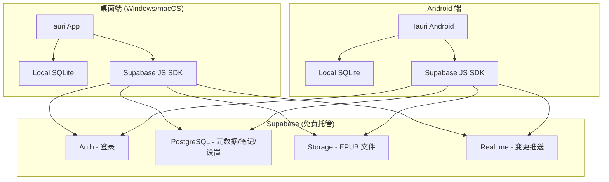
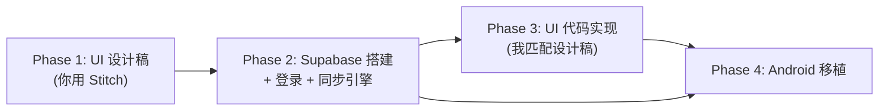

# DeepReader 需求评估报告 (v2)

## 项目现状快照

| 维度 | 数据 |
|---|---|
| 技术栈 | Tauri 2.8 (Rust) + React 19 + Vite 7 + TailwindCSS 4 + Zustand |
| 前端代码 | ~310 文件，~34,600 行 TypeScript/TSX |
| Rust 后端 | ~3,400 行，含 2 个自定义 Tauri 插件 (epub, llamacpp) |
| 数据库 | SQLite (tauri-plugin-sql)，8 张表 |
| UI 组件 | 33 个 Radix UI 基础组件 + shadcn/ui 封装 |
| AI 集成 | Vercel AI SDK (ai@5)，多 provider (OpenAI/Anthropic/DeepSeek/Google/OpenRouter) |
| 上游来源 | Fork 自 [SageRead/Readest](https://github.com/xincmm/sageread)，保留了大量原始架构 |

---

## 关于 tauri-plugin-llamacpp

这是一个**本地 LLM 推理插件**，功能：
- 在桌面端启动一个 llama.cpp server 进程（捆绑了 `llama-server` 二进制）
- 用于**本地 Embedding 向量化**，支持整本书的语义检索
- 用户可以下载 GGUF 格式的小型 Embedding 模型到本地运行
- **不是核心阅读功能**，是可选的高级功能（不配置也能用 AI 对话，只是没有全书检索）

安卓端影响：这个插件在移动端大概率要**降级为纯 API 调用模式**（远程向量模型），不跑本地推理。代码里已有 `vectorModelEnabled` + 远程模型的分支，可以在移动端强制走远程。

---

## 需求 1：UI 重构

### 设计语言提取（基于 Logo）

Logo 的设计语言很明确：

| 特征 | 值 |
|---|---|
| 主色 | 深海蓝 `rgb(15,52,106)` / `#0F346A` |
| 辅色 | 天空蓝 `rgb(43,108,203)` / `#2B6CCB` |
| 点缀色 | 浅蓝 `rgb(134,206,252)` / `#86CEFC` |
| 中性色 | 暖象牙白 `rgb(237,229,215)` / `#EDE5D7` |
| 风格 | 圆润友好、微立体（3D 翻页感）、干净简约 |
| 调性 | 亲和但不幼稚、专业但不冰冷——"有温度的工具感" |

### Stitch 提示词建议

以下是给 Stitch 用的设计提示词框架，你可以按页面分别投喂：

```
Design a desktop reading application UI with these constraints:

Brand Identity:
- Primary: Deep navy blue (#0F346A) — used for navigation, headers, key interactive elements
- Secondary: Medium blue (#2B6CCB) — buttons, links, active states
- Accent: Sky blue (#86CEFC) — highlights, badges, progress indicators
- Surface: Warm ivory (#EDE5D7 in light mode) with clean whites (#FAFAFA)
- Dark mode: Deep navy (#0A1628) base with blue-tinted grays

Design Language:
- Rounded corners (8-12px radius), matching the logo's soft book shape
- Subtle depth through layered cards (light shadows, no hard borders)
- Clean whitespace, generous padding — a reading app should breathe
- Typography: CJK-optimized sans-serif (Inter/Noto Sans), comfortable reading scale
- Micro-interactions: gentle hover lifts, smooth transitions (200-300ms)

Functional Constraints (DO NOT REMOVE these entry points):
- Left sidebar (192px): 图书馆 / 聊天 / 记忆 / 技能库 / 阅读统计 / 设置
- Library view: grid + list toggle, tag filtering, search, book cards with covers
- Reader view: EPUB reader (center) + AI chat sidebar (resizable right) + notebook panel
- Settings dialog: 6 sections (关于/外观/数据文件夹/Obsidian/联网搜索/记忆提取)
- Status bar in reader with reading progress

Page: [指定你要设计的具体页面]
```

> [!IMPORTANT]
> **功能入口保护清单**——不管 UI 怎么改，这些入口必须保留：
> - Sidebar 5 个导航项 + 设置按钮
> - Library 页的搜索、标签筛选、排序、视图切换、拖拽导入
> - Reader 页的 AI 对话面板、笔记面板、目录导航、阅读进度条
> - 设置中的模型配置、Obsidian 路径、Tavily API Key、向量模型、记忆提取模型
> - 笔记页的 Obsidian 导出、标注列表
> - 阅读统计的热力图和时长数据

### 工作流

1. 你用上面的提示词 + logo 投 Stitch，按页面出稿
2. 设计稿确认后回传给我
3. 我负责将设计稿映射到现有组件体系（改 token + 局部组件调整），**不动业务逻辑**

**改动量：15-23 人天**（有设计稿的情况下可缩短到 10-15 天）

---

## 需求 2：后端选型（自用，免费/低成本）

### 结论先行：用 Supabase Free Tier

| 方案 | 月成本 | 自托管 | 推荐度 |
|---|---|---|---|
| **Supabase Free** | ¥0 | 可选（也可用官方托管） | ⭐⭐⭐⭐⭐ |
| Firebase Spark | ¥0 | 不可自托管 | ⭐⭐⭐ |
| PocketBase | ¥0 (自托管) | 必须自托管 | ⭐⭐⭐⭐ |
| Appwrite Cloud | ¥0 | 可选 | ⭐⭐⭐ |
| 自建 (Express/Hono + SQLite) | VPS ¥30-50/月 | 是 | ⭐⭐ |

**推荐 Supabase 的原因：**

1. **Free Tier 足够自用**：500MB 数据库、1GB 文件存储、50K 月活用户、5GB 带宽
2. **自带认证**：Email/密码登录开箱即用，省掉整个需求 3
3. **PostgreSQL + Row Level Security**：比 Firebase 的 NoSQL 更适合结构化书籍数据
4. **实时同步能力**：Supabase Realtime 可以做双端数据推送
5. **文件存储**：Supabase Storage 可以存 EPUB 文件（1GB 免费额度，自用够了）
6. **可自托管**：如果将来不信任官方托管，整套 Supabase 可以用 Docker 部署到自己 VPS
7. **JS SDK 成熟**：`@supabase/supabase-js` 直接在 Tauri 前端调用，不需要额外 Rust 后端

**不需要建服务器。** Supabase 官方免费托管已经够了。如果将来想自托管，一台 ¥30/月的轻量 VPS 就能跑。

### 同步架构设计



**同步粒度决策：**

| 数据 | 同步？ | 方式 |
|---|---|---|
| API Key / 模型配置 | ✅ | 加密后存 PostgreSQL（AES-256，密钥 = 用户密码派生） |
| 书籍元数据（标题/作者/进度） | ✅ | PostgreSQL |
| 阅读笔记 / 标注 / 高亮 | ✅ | PostgreSQL |
| 对话历史 | ✅ | PostgreSQL（压缩存储） |
| 记忆系统 | ✅ | PostgreSQL |
| EPUB 文件本身 | ✅ | Supabase Storage（1GB 免费，自用够几十本） |
| 本地 Embedding 模型 | ❌ | 太大，不同步 |

---

## 需求 3：Obsidian 同步（安卓端）

### 现状

桌面端的 Obsidian 集成是**直接写文件到本地 Vault 目录**（[export-obsidian.ts](file:///d:/Project/deepreader-publish-20260415-193455/packages/app/src/ai/tools/export-obsidian.ts)），简单直接。

### 安卓端方案

| 方案 | 可行性 | 说明 |
|---|---|---|
| **Obsidian Sync（官方）** | 高，但 ¥68/月 | 官方方案，最稳定 |
| **通过 OneDrive/坚果云 同步 Vault** | 高，免费 | 安卓 Obsidian 支持"打开 Vault from 文件夹"，配合 FolderSync 等自动同步工具 |
| **DeepReader 直接写入同步文件夹** | 高 | 最简方案：安卓端的 Obsidian Vault 路径也配置成 OneDrive 同步目录 |

**推荐路径：OneDrive 方案**

具体流程：
1. 安卓端安装 OneDrive App → 自动同步指定文件夹
2. Obsidian 安卓版选择从 OneDrive 同步的本地文件夹打开 Vault
3. DeepReader 安卓端的 `obsidianVaultPath` 配置为同一个目录
4. 写入 → OneDrive 自动同步 → 桌面端 Obsidian 看到

这个方案**不需要 DeepReader 做任何特殊开发**，只是安卓端的文件系统权限要处理好（Android Scoped Storage 限制写入外部目录，可能需要用 SAF 或者写入 App 私有目录再通过 OneDrive 同步）。

> [!TIP]
> 笔记反向进知识库的需求，现有的 `exportToObsidianTool` 已经实现了——AI 对话中可以通过工具调用直接写 Markdown 到 Vault。安卓端只要路径配好，同样的代码直接可用。

---

## 需求 3：账号登录（修订）

### 用 Supabase Auth 替代自建

直接用 Supabase 内置认证，**不需要写任何后端代码**：

| 任务 | 工作量 |
|---|---|
| Supabase 项目初始化（建表、配 RLS） | 1 天 |
| 前端登录/注册 UI（Email + 密码） | 2 天 |
| Token 管理（自动刷新、本地缓存） | 1 天 |
| 本地数据迁移（首次登录后上传已有数据） | 2 天 |
| 同步引擎（增量同步 + 冲突解决） | 5-8 天 |

**总计：11-14 人天**（比之前估的 12-20 天缩短，因为不用建后端）

### 砍掉的部分

- ~~付费体系 (free/plus/pro quota)~~：不需要维护
- ~~OAuth (微信/GitHub)~~：自用不需要，Email 登录够了
- ~~后端 API Server~~：Supabase 直连，不需要中间层

---

## 修订后的总工时和执行顺序



| Phase | 内容 | 人天 | 依赖 |
|---|---|---|---|
| 1 | UI 设计稿 (Stitch) | 你来，不计入 | 无 |
| 2 | Supabase + 登录 + 同步 | 11-14 天 | 无 |
| 3 | UI 代码实现 | 10-15 天 | Phase 1 设计稿 |
| 4 | Android 客户端 | 22-35 天 | Phase 2 同步就绪 |
| **总计** | | **43-64 人天** | |

对比之前的 78-124 人天，主要节省来自：
- Supabase 替代自建后端（-15~25 天）
- 砍掉付费体系（-5 天）
- 有设计稿加速 UI 实现（-5 天）
